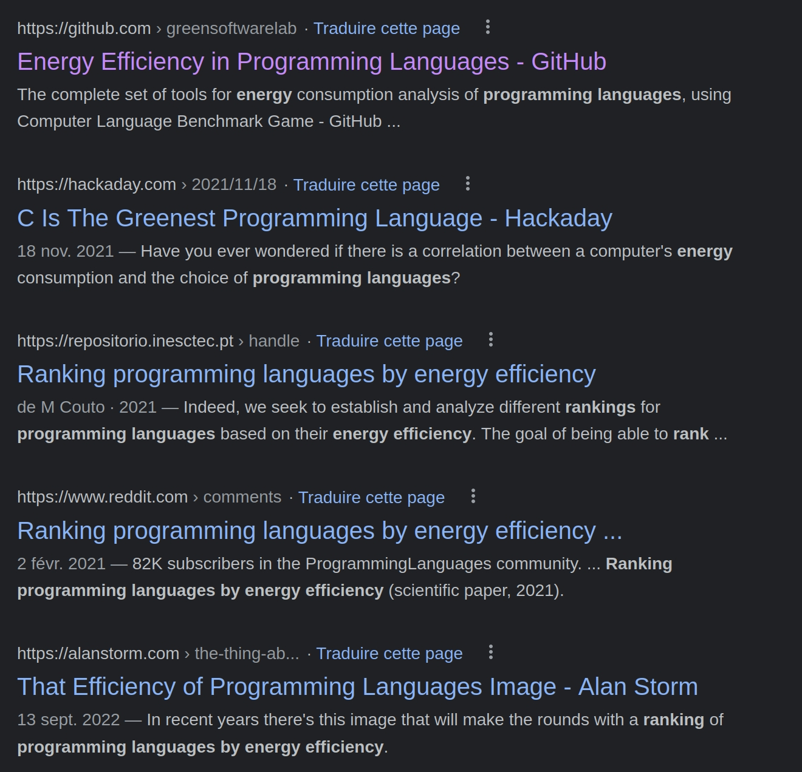
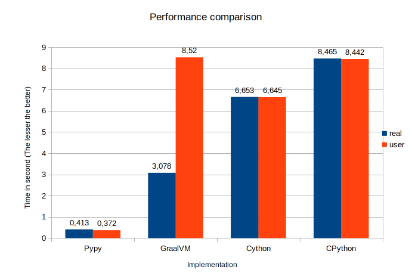
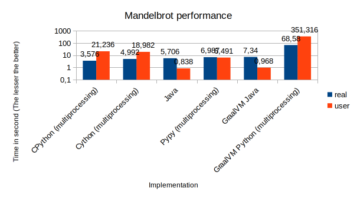

# Python is just an idiom

## Abstract

This article and code repository aim to highlight that Python is just an idiom, a syntax.
A langage is just a langage. It is not directly executed.

It is easily highlighted when the same code is executed with compltly different performances
depending on their implementation.

Regardless of what can be said by those many experts benchmarking langages for any purpose.
The same Python code will be here executed in different environnements, in their latest versions,
highlighting performance differences and potential outcomes.

Those environnements are just a set of relevant Python environments but are
not by far exhaustive.

An eye-opener was the 2015 Green Code Lab Challenge[^1], 82 teams in 8 countries,
where the langages where ranked the following:

1. Python
2. C++
3. Python
4. Javascript
5. Python
6. C++
7. Python
8. Python
9. Python
10. Python

Each team has a raspberry as server model, running Greenspector. Keep in mind:
*Lot of teams don’t success in having measures or functional application.
The reasons : no agility for certain teams, tunnel effect with a rush the
Friday, application not robust…* i.e. the challenge was functionally complex enough
to use simple idiom like Python.

## A common misconception to compare langages without carrying about the runtime environnement

Many articles, including academics, are comparing the efficiency of a programming
langage under multiple aspects, such as execution time, energy, etc.
Some of them not even mentioning the environment and the langage implementation like João Saraiva et al.[^2].
This raise many questions for a langage such as Python having numerous implementations,
3 of them, CPython, Cython, Pypy being really mainstream. This paper measure the
CPU time and state the Energy = Power x Time, but not sure, they refer to article
stating the contrary.

Alibabacloud performed a survey on energy efficiency, without detailed method[^3]

Overwhelming results in Google:



## Multiplying the wrong way

```python
120000000 * 5
```

The multiplication above is almost instantaneous in the CPython interpreter, hopefully.

```python
from dis import dis


def add5(n):
    s = 0
    for _ in range(n):
        s += 5
    return s


add5(120000000)
dis(add5)
```

The above program is doing the same plus trying to disassemble it. This is obviously
slower when interpreted in CPython. But a smart compiler is probably able to
optimize those addition turning it to a multiplication.
Let's try different Python implementations compiled or interpreted to look for
major performance differences in the same langage.

### Cython[^4]

A static compiler for Python programming langage. Many would say a transpiler to C/C++.
The code is then compiler, here with `clang`.

#### Compilation

```shell
cython --embed -o multiply.c -3 multiply.py
clang -O3 multiply.c -o multiply -I/usr/include/python3.10 -lpython3.10
```

#### Environnement

```shell
chrichri@chrichri-HKD-WXX:~/python-is-a-syntax$ cython -V
Cython version 0.29.32
chrichri@chrichri-HKD-WXX:~/python-is-a-syntax$ clang -v
Ubuntu clang version 14.0.0-1ubuntu1
Target: x86_64-pc-linux-gnu
Thread model: posix
InstalledDir: /usr/bin
Found candidate GCC installation: /usr/bin/../lib/gcc/x86_64-linux-gnu/10
Found candidate GCC installation: /usr/bin/../lib/gcc/x86_64-linux-gnu/11
Selected GCC installation: /usr/bin/../lib/gcc/x86_64-linux-gnu/11
Candidate multilib: .;@m64
Selected multilib: .;@m64
```

#### Speed and disassembly

```shell
chrichri@chrichri-HKD-WXX:~/python-is-a-syntax$ time ./multiply
600000000

real    0m6,646s
user    0m6,505s
sys     0m0,012s
```

### Pypy[^5]

* *A fast, compliant alternative implementation of Python... On average, PyPy is 4.5 times faster than CPython*.
  Use a JIT (Just In Time) Compiler.
  [Guido van Rossum would have said at 2015 EuroPython that Pypy is the workaround to GIL issues](https://www.google.com/url?sa=t&rct=j&q=&esrc=s&source=web&cd=&cad=rja&uact=8&ved=2ahUKEwihpqX6ja77AhUX8LsIHRkvAHIQFnoECAUQAQ&url=https%3A%2F%2Flwn.net%2FArticles%2F723716%2F&usg=AOvVaw07eqriHjK5dt4pidA6W2f_)
  .

Slightly faster than CPython but no disassembly.

#### Environnement

```shell
Python 3.9.12 (05fbe3aa5b0845e6c37239768aa455451aa5faba, Mar 29 2022, 08:15:34)
[PyPy 7.3.9 with GCC 10.2.1 20210130 (Red Hat 10.2.1-11)] on linux
```

#### Speed and disassembly

```shell
chrichri@chrichri-HKD-WXX:~/python-is-a-syntax$ time ./pypy3.9-v7.3.9-linux64/bin/python3 multiply.py 
  5           0 LOAD_CONST               1 (0)
              2 STORE_FAST               1 (s)

  6           4 LOAD_GLOBAL              0 (range)
              6 LOAD_FAST                0 (n)
              8 CALL_FUNCTION            1
             10 GET_ITER
        >>   12 FOR_ITER                12 (to 26)
             14 STORE_FAST               2 (_)

  7          16 LOAD_FAST                1 (s)
             18 LOAD_CONST               2 (5)
             20 INPLACE_ADD
             22 STORE_FAST               1 (s)
             24 JUMP_ABSOLUTE           12

  8     >>   26 LOAD_FAST                1 (s)
             28 RETURN_VALUE

real    0m0,413s
user    0m0,372s
sys     0m0,025s
```

### CPython[^6]

Original implementation from 1991 by Guido van Rossum.

#### Environnement

```shell
Python 3.10.6 (main, Nov  2 2022, 18:53:38) [GCC 11.3.0] on linux
Type "help", "copyright", "credits" or "license" for more information.
```

#### Speed and disassembly

```shell
chrichri@chrichri-HKD-WXX:~/python-is-a-syntax$ time python3 multiply.py
  5           0 LOAD_CONST               1 (0)
              2 STORE_FAST               1 (s)

  6           4 LOAD_GLOBAL              0 (range)
              6 LOAD_FAST                0 (n)
              8 CALL_FUNCTION            1
             10 GET_ITER
        >>   12 FOR_ITER                 6 (to 26)
             14 STORE_FAST               2 (_)

  7          16 LOAD_FAST                1 (s)
             18 LOAD_CONST               2 (5)
             20 INPLACE_ADD
             22 STORE_FAST               1 (s)
             24 JUMP_ABSOLUTE            6 (to 12)

  8     >>   26 LOAD_FAST                1 (s)
             28 RETURN_VALUE

real    0m8,465s
user    0m8,442s
sys     0m0,016s
```

### GraalVM Python[^7]

The polyglot JVM by oracle. It aims to move as many possible application to Oracle GraalVM in cloud services, CoBOL,
CPP, Java, Python. Python in GRaalVM can access AWT! On performance side, according
to Oracle there
is *On average, Python in GraalVM (entreprise) is 8.92x faster than CPython*

#### Environnement

```shell
chrichri@chrichri-HKD-WXX:~/python-is-a-syntax$ ./graalvm-ce-java11-linux-amd64-22.3.0/graalvm-ce-java11-22.3.0/bin/graalpy 
Python 3.8.5 (Thu Oct 20 10:52:00 UTC 2022)
[Graal, GraalVM CE, Java 11.0.17] on linux
Type "help", "copyright", "credits" or "license" for more information.
>>> 
```

#### Speed and disassembly

```shell
chrichri@chrichri-HKD-WXX:~/python-is-a-syntax$ time ./graalvm-ce-java11-linux-amd64-22.3.0/graalvm-ce-java11-22.3.0/bin/graalpy multiply.py 

real    0m3,078s
user    0m8,520s
sys     0m0,434s
```

The `dis` disassembly appears to be missing. Somehow it look mocked as it can be imported
but nothing is ever returned.

### Performance discussion

Implementations are ordered by user time.



Not obvious as the disassembly of CPython Pypy where pretty much the same but there is a 20 time
speed improvement with Pypy. Pypy JIT understand at some point this addition is in fact a multiplication.

In the same langage, Python, the CPython can be more than 20 time slower than Pypy implementation:

| Implementation | real  | user  | Ratio user time to faster |
|----------------|-------|-------|---------------------------|
| Pypy           | 0,413 | 0,372 | 1                         |
| GraalVM        | 3,078 | 8,52  | 7,45                      |
| Cython         | 6,653 | 6,645 | 16,11                     |
| CPython        | 8,465 | 8,442 | 20,5                      |

## Relevance of comparing a langage to another

The famous website landing page statement is unambiguous *Which programming
language is fastest? Let's go measure … benchmark programs !*. This website only
compares different version of same implementation. It should probably better compare
different implementations. Plus the CPU is the usr+sys time giving a false sense the
smallest time is the fastest.
Different figures from the Java source[^8] and Python 3 source[^9] Mandelbrot
computation from the benchmark game are plotted (Warning time axis in logarithmic
scale due to GraalVM Python). Implementations are ordered by user time.



It highlights the two Java implementations consume less resources but from real
time point of view, both CPython and Cython are faster. Which fact is completely
hidden by the benchmark results. Python is also the slower when running in Graal VM.

[^1]: <https://medium.com/eco-design-of-software-by-greenspector/analyse-of-results-of-green-code-lab-challenge-2015-ed04907c01c5>

[^2]: <https://greenlab.di.uminho.pt/wp-content/uploads/2017/09/paperSLE.pdf>

[^3]: <https://www.alibabacloud.com/fr/knowledge/tech/10-programming-languages>

[^4]: <https://cython.org>

[^5]: <https://www.pypy.org/>

[^6]: <https://python.org>

[^7]: <https://www.graalvm.org/python/>

[^8]: <https://benchmarksgame-team.pages.debian.net/benchmarksgame/program/mandelbrot-java-1.html>

[^9]: <https://benchmarksgame-team.pages.debian.net/benchmarksgame/program/mandelbrot-python3-7.html>
